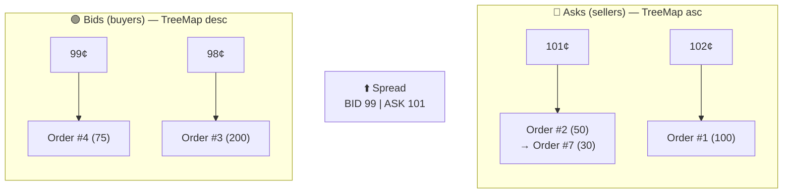

# order-matching-engine

> *How does an order matching engine actually work inside? What data structures make matching fast? This mini-project is my way of answering those questions by writing code.*

This is **not** a distributed system with Kafka, Redis, and 47 microservices. It's the exact opposite: a **Limit Order Book** (LOB) implemented in pure Kotlin, with no dependencies, no frameworks, no I/O. Just the JVM, carefully chosen data structures, and the matching rules used by real-world exchanges.

The goal is to explore the problem from first principles: price-time priority, FIFO queues, balanced trees, and how the JVM handles (or doesn't handle) primitives.

---

## 💡 What does it do?

A **matching engine** receives buy and sell orders and matches them against each other when prices are compatible. It's the heart of any financial exchange.

This engine implements:

- **Price-Time Priority (FIFO)** — best price first, and within the same price level, first come, first served.
- **Full Fill & Partial Fill** — an aggressive order can consume multiple passive orders, or just a portion of one.
- **Cancellations** — with an auxiliary index so there's no need to scan the entire book.
- **Immutability** — `Order` and `Trade` objects are never mutated; partial fills produce new copies.

---

## 🔁 Lifecycle of an aggressive order

This is the path an order follows from the moment it enters the engine until it generates trades or gets parked as a passive order:


---

## 🧱 How the book is organized

The order book isn't a flat list — it's two trees (one for buys, one for sells) where each node is a price level with its own FIFO queue:



Each **price level** is a `PriceLevel` that internally holds an `ArrayDeque<Order>` — a circular array buffer that guarantees O(1) insertion/removal and, being contiguous memory, takes much better advantage of the CPU's L1/L2 cache than a linked list.

---

## 🧮 Why these data structures?

| Question | Answer | Data Structure |
|----------|--------|----------------|
| What's the best bid/ask price? | O(1) via `firstEntry()` | `TreeMap` (Red-Black Tree) |
| Who arrived first at this price? | O(1) via `removeFirst()` | `ArrayDeque` (circular array) |
| Where is order #42 to cancel it? | O(1) via `get(42)` | `HashMap<Long, Order>` |
| Need to insert a new price level? | O(log P) | `TreeMap.getOrPut()` |

> *P = active price levels in the book.*

---

## 🔬 Interesting design decisions

**`@JvmInline value class` for `Price` and `Quantity`**
Kotlin lets you create semantic types (`Price(101)` instead of a naked `Long`) without paying the cost of a heap-allocated object. The compiler erases the wrapper and passes the raw `long` primitive directly. Zero allocations on the hot path.

**Immutability + `.copy()`**
When a passive order is partially filled, it's not mutated — it's destroyed and a new copy with the remaining quantity is created and reinserted at the head of the queue. More functional, safer, and leaves the door open for lock-free concurrency.

**`ArrayDeque` instead of `LinkedList`**
Both support FIFO, but `ArrayDeque` is a contiguous block of memory. In matching, where you iterate and consume nodes sequentially, cache locality makes a real difference.

**`HashMap` as a reverse index**
Without this index, cancelling order #42 would mean: *"walk through every price level, and within each level, the entire queue, until you find it."* With the `HashMap`, it's a direct lookup to the object, and from there you know which tree and which price level to search.

---

## ▶️ Quick example

```kotlin
val book = OrderBook("AAPL")

// Market makers inject liquidity
book.addOrder(Order(id = 1, asset = "AAPL", side = Side.ASK, priceCents = Price(101), quantity = Quantity(50)))
book.addOrder(Order(id = 2, asset = "AAPL", side = Side.BID, priceCents = Price(99),  quantity = Quantity(75)))
// Spread: BID 99 | ASK 101

// Aggressive buy order that crosses the ask
val trades = book.process(
    Order(id = 3, asset = "AAPL", side = Side.BID, priceCents = Price(101), quantity = Quantity(30))
)
// → 1 trade: 30 shares @ 101¢ (partial fill of order #1)
// → Order #1 remains on the ask side with 20 shares left
```

---

## 📁 Project structure

```
src/main/java/com/rubenjpdev/ordermatching/
├── model/
│   └── Domain.kt        # Side, Price, Quantity, Order, Trade
├── engine/
│   ├── OrderBook.kt     # The engine — addOrder, cancelOrder, process
│   └── PriceLevel.kt    # FIFO queue per price level
└── Main.kt              # Demo with a matching scenario
```

---

## 📖 Deep dive

For the detailed version with Big O complexity analysis of every operation, the internal hot path matching flow, and design trade-offs, check out [`ARCHITECTURE.md`](./ARCHITECTURE.md).

---

## Requirements

- JDK 17+
- Kotlin 1.9+
- An IDE (IntelliJ recommended) or `kotlinc` from the terminal

---

## License

[MIT](./LICENSE)